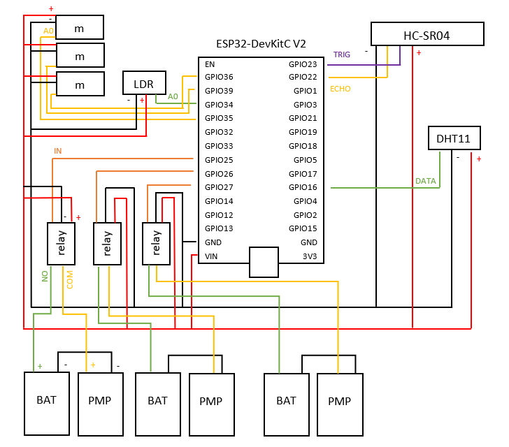
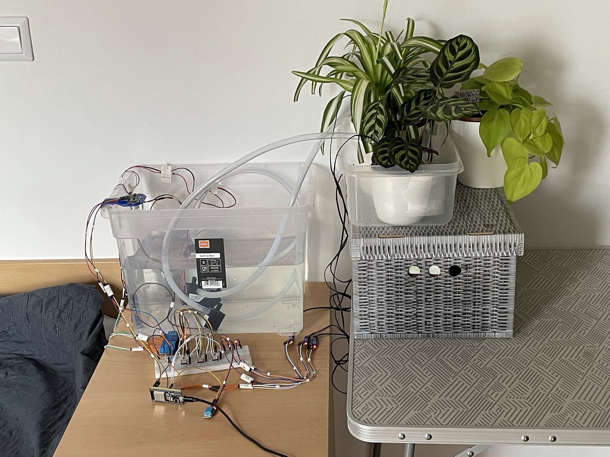
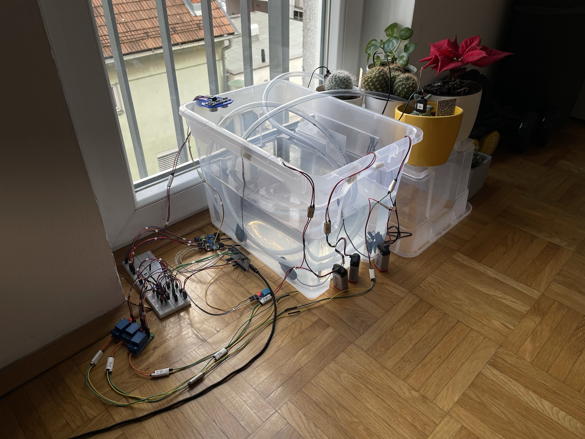

# PWS ESP-32
> ESP-32 code for embedded part of plant watering system.

## Table of contents
* [General info](#general-info)
* [Technologies](#technologies)
* [Setup](#setup)
* [Features](#features)
* [Status](#status)
* [Contact](#contact)

## General info
Embedded part of multi-layered information system made for practical part of diploma thesis. Complete functioning product is made out of 3 repositories:
* [PWS Monitoring](https://github.com/JanaJankovic/pws-monitoring)
* [PWS Server](https://github.com/JanaJankovic/pws-server)
* PWS ESP-32(This one)

## Technologies
* ESP-32
* ArduinoIDE

## Setup
Download the code and upload it to your ESP32.
Your circuitry needs to look like this:

## Setup Example
Watering system with indirect sunlight  
  
Watering system with direct sunlight  
  

## Features

* Watering
* Monitoring
* Notifications
* Automatic update of plant list

## Status
Project is: _finished_

## Contact
Created by [@JanaJankovic](https://github.com/JanaJankovic) - feel free to contact me!
